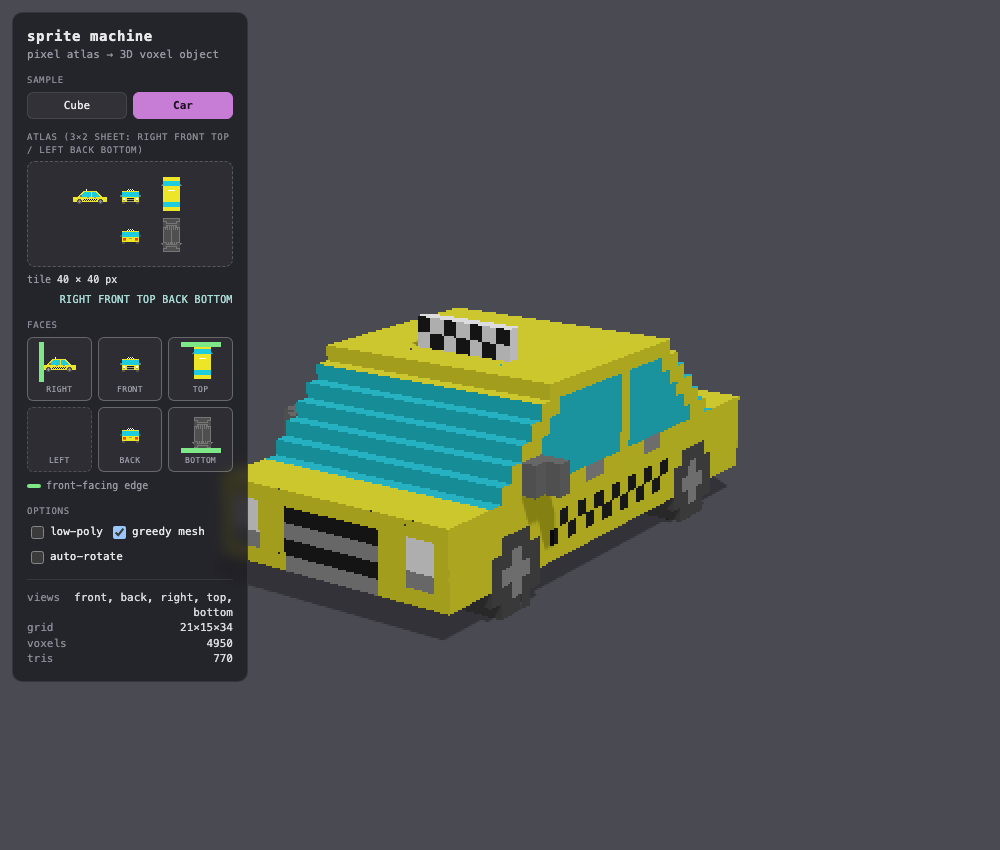

# sprite machine

Turns low-resolution pixel-art face sprites (top, front, side and so on) into a
rotatable Three.js 3D object. The blocky look is modeled in the geometry.



```bash
npm install
npm run dev        # http://localhost:5173
npm test           # both packages' unit suites (node --test)
npm run typecheck  # tsc checkJs over both packages (JSDoc types)
npm run lint       # prettier --check .   (npm run format to fix)
npm run build      # static bundle in dist/
```

The engine (pipeline, mesher, file formats) is the npm package
`sprite-machine` in `packages/core`, a second workspace whose one dependency
is `earcut`. Its [README](packages/core/README.md) documents the API.
`buildModel` returns the model as typed arrays and a skin bitmap at one unit
per voxel, `modelToGlb` writes the glb that File → Export 3D Model… writes,
and `sprite-machine/three` turns the model into a THREE.Mesh, with `three` an
optional peer. `sprite-machine/node` adds `readSheet` and `sheetToGlb` over a
document PNG's bytes, and `npx sprite-machine build` runs them from a shell.
`sprite-machine/browser` decodes and encodes PNGs over the platform's
compression streams, and the app opens and saves documents with it. The app
imports the engine by name through the workspace link.
`npm publish -w packages/core` releases the engine alone. The app deploys to
GitHub Pages on every push to `main` (`.github/workflows/pages.yml`):
<https://aportilla.github.io/sprite-machine/>.

The gates are `npm test`, `npm run lint`, `npm run typecheck` and
`npm run build`, and the Pages workflow runs all four before it deploys. There
are no browser tests. The look and the wiring are checked by eye.
`tools/capture.sh` screenshots a running dev server when a picture helps. It
is not a check.

```bash
tools/capture.sh shot 'http://localhost:5173/?sample=car' /tmp/shot.png
tools/capture.sh dom  'http://localhost:5173/?diag=1'   # light-DOM shell + title
```

The testing policy is in [Testing](#testing).

The app is a System 7 style desktop built with the
[`vintage-frames`](https://github.com/aportilla/vintage-frames) web component
kit. It has a menu bar, an options strip, one movable document window per open
document, and floating utility windoids that serve the active document: the
**Tools** palette, the **Full Sprite View** (the face picker over a clickable
row of the atlas's tiles), the **3D View**, the **Color Palette** (the
document's colors), and one toggleable windoid, the **3D Sprite Atlas** (the
model rendered orthographically from a ring of angles, which File → Export
Sprite Atlas… saves). Documents are files on the
desktop, saved in the browser and opened by double-clicking their icons.
Folders hold them and the Trash deletes them. Read-me text files ship with the
app and open in the Text Viewer (see [Text files](#text-files)). Clicking the
desktop switches to the Finder: the Sprite Editor deactivates and its windoids
hide. The menu bar shows the front application's menus. See
[The desktop](#the-desktop).

The first boot seeds two starter documents, Car and Cube, and the built-in text
files (`src/texts/`: Read Me and Keyboard Shortcuts) as ordinary saved files.
Seeding runs once per profile, recorded by the `seeded` and `seededTexts`
flags. `seeded` is written only after every built-in is stored, so a first boot
cut short by a reload finishes seeding on the next load. A deleted built-in, or
one added to the app after a profile's first boot, is stored only by the
Finder's **Special → Restore Default Files** (see [Menu bar](#menu-bar) and
[Desktop icons & state](#desktop-icons--state)).

Each load opens the About box while its **Show at startup** checkbox is checked
(the default). Otherwise it shows the bare desktop. OK or a click outside the
box closes it (see [The About box](#the-about-box)). A URL that names a saved
document (`?file=Cube` or `#Cube`) opens that file on its last edited face
instead. The match is case-insensitive, and the most recently modified document
wins a collision. Windows from a previous session do not reopen, and every
application window is placed fresh from the live raster (see
[Windows](#windows)). The desktop icons and each folder window's box, as a
nine-slice pin, are restored. Opening, saving or switching to a saved document
writes its name into the URL fragment with `replaceState`, and an untitled
document clears it, so a reload restores what is on screen. The starter
documents are also templates in File → New…. A 3×2 sprite sheet PNG dropped
anywhere on the page opens as a new document.

Smooth slopes (low-poly additive 45° wedges) and the planar merge are always
on. The 3D View's header has two controls, off on every load: **rotate**
(auto-spin) and **single layer**, which shows only the edited layer. Sprites
are hard pixel art: every texel is fully opaque or fully transparent. A face
with no view of its own is mirror-filled from its opposite at render time. The **face picker** selects which of the six faces you edit,
and the **Layer** menu which layer. A mirror-derived face shows as empty.

## Input: a 3×2 atlas

One sheet holds six tiles in this fixed layout. An empty tile falls back to
mirroring.

```
LEFT   FRONT  TOP
RIGHT  BACK   BOTTOM
```

The tile size is derived from the image dimensions (a 120×80 sheet has 40×40
tiles). Each tile is a literal slice of the voxel lattice: a pixel's position
in its tile is its position in the object. Tiles are read at full size, with no
auto-crop, and must line up across faces. A FRONT pixel is solid only where the
SIDE covers its row and the TOP covers its column. Use square tiles for a cubic
lattice. The editor's underlay helps line pixels up.

**Layers.** A document stacks up to eight layers (`LAYER_MAX`). The sheet grows
downward, one 3×2 block of six tiles per layer, every block at the one tile
size: `3t × 2tN` for N layers, Layer 1 on top. Each layer carves its own hull
and the model is their union (see
[The technique](#the-technique-multi-view-visual-hull-voxelization)), so it can
hold shapes one set of six views would fill in, such as wheels apart from the
body above them. The app takes the count from the shape: a `3t × 2tN` sheet of
square tiles, `t` from 1 to 64 and N from 1 to 8, is N layers, and the
`sprite-machine:layers` chunk only names them (see
[Documents](#documents-a-document-is-a-png)). Any other sheet opens as one layer
of whatever the 3×2 layout gives.

**Tile orientation** (world: `+x` right, `+y` up, `+z` front, toward the
camera). Each tile is its face as seen from outside, never a mirror image. A
tile drawn this way needs no transform:

| Tile         | Draw as…                                           | Front points | Size           |
| ------------ | -------------------------------------------------- | ------------ | -------------- |
| FRONT / BACK | head-on / from behind, upright                     | —            | width × height |
| RIGHT        | the right side                                     | right        | depth × height |
| LEFT         | the left side                                      | left         | depth × height |
| TOP          | from above, the right side on the right            | top edge     | width × depth  |
| BOTTOM       | from below (car rolled sideways, not end-over-end) | top edge     | width × depth  |

Check each tile against the Front points column, using the faded underlay of
the mirrored opposite behind the canvas. The pipeline accepts per-tile `rot`,
`flipX` and `flipY` transforms for sheets that don't follow the convention, and
applies each to the same-named tile of every layer.

## Drawing editor

The **document window** holds the drawing surface in a white artwork well. The
tools are in the floating **Tools palette**, their options in the **options
strip** under the menu bar, and the tile size behind Edit → Tile Size…. Edits
write straight into the current sheet, so Save stores what you see. The Full
Sprite View follows every stroke at frame rate, and the model rebuilds
(rAF-debounced) without moving the camera.

- **Canvas layout**: the canvas fills the well (its height from CSS flex) and
  is drawn on the kit's system-pixel grid. The texel size is the largest whole
  number of system px that fits the tile plus one texel of edge hint per side,
  so a texel is whole device px at any density or zoom. `#layout()` places the
  canvas stack and the edge-hint frame (a texel larger per side) as
  `vf-container`s in whole system px, centering the outer box arithmetically.
  The paper is the kit's 12% dither (`gray-12`), declared as the stack's
  `pattern`, because a bare `vf-container` paints the desktop pattern.
  The dither marks transparency, so white art shows as a clear patch. No grid
  lines are drawn.
- **Edge hints**: the four neighbouring faces' art, one texel deep, just
  outside the canvas edges, so features can be lined up across faces. Editing
  the front, the side views' front-most painted texels run down the left and
  right edges and the top tile's front row lies across the top. `lib/edges.js`
  derives each edge's neighbour, scan line and direction from
  `VIEW_IMAGE_AXES`. Each strip texel is the first painted texel walking inward
  from the seam. A neighbour with no art contributes its mirrored opposite. The
  neighbours are the edited layer's own, and other layers never show there. The
  corners stay empty. The strips sit on the canvas's texel lattice with no gap,
  at full opacity, on white, so the dithered rectangle is exactly the drawable
  area. They take no pointer input. A stroke never changes them, since a
  face's neighbours exclude the face and its opposite.
- **Tools**: six 22×19 cells in a column, **selection** `S`, **pencil** `B`,
  **rect** `R`, **fill** `G`, **eraser** `E`, **eyedropper** `I`. Each cell is
  a 1-bit PNG drawn 1:1 through `vf-img` (`TOOL_CELL`, from which `TOOLS_BOX`
  derives). The selected cell inverts with a CSS `invert`, exact only for pure
  black art. A cell picks on press, not on click.
- **The options strip** is a kit band (`pattern="white" rule="bottom"`) with
  the current-ink swatch and the tool's options. It has no tool-name caption,
  and no label is dimmed. A dotted `<vf-separator vertical>` stands between
  the swatch and the options, between the rect's radius field and its size
  readout, and between the selection's size readout and its flip buttons. A
  control and its own readout have no separator.
- **Pencil**: a tip-shape popup (`circle` / `square`, circle at every load), a
  size slider (1 to the tile size) and an `N px` readout. The circle tip is the
  disc inscribed in the N×N box, the square the whole box. `brushRows` defines
  the covered texels for the stamp, the stroke and the hover preview. The hover
  preview is the tip filled with the ink, or the erase treatment under the
  right button.
- **Rect**: a corner-radius field (`0` is sharp) and a `W × H` readout of the
  drag, `0 × 0` between drags. A drag previews the exact filled texels at full
  opacity. A right-drag erases. Release commits. Esc or a tool switch cancels.
  Shift locks the box square, also mid-drag. Corners are convex quarter-circle
  arcs, so a radius of 1 clips the corner texel (`lib/rect.js`).
- **Fill**: **contiguous** (on by default) floods the 4-connected region. Off,
  it recolors every texel on the face matching the clicked color, and **on all
  faces** (enabled only then) does so across the edited layer's six tiles.
  Clicking empty space targets transparent, and a right-click fills to
  transparent.
- **Selection** (`S`): drag a box to select it. The border is marching ants,
  1 system px on the outermost texels, drawn as whole-pixel black and white
  runs (`lib/ants.js`) on their own top layer. They stand still under reduced
  motion. Drag inside to move the pixels, leaving transparency behind. Shift
  constrains the move to one axis. Transparent texels in the selection don't
  move, so a moved selection overwrites only where it is painted. Click
  outside, press Esc or pick another tool to drop it. Esc mid-drag cancels the
  drag, and a cancelled move returns to where it was grabbed. A press is a
  click, and makes no selection, until the pointer moves 3 px or onto another
  texel. One texel is the smallest selection. The options strip shows its
  `W × H`. Texels off the tile at the drop are lost (Undo restores them). A
  move gesture is one undo step, and a marquee writes nothing. A structural
  change drops the selection, and each document window has its own. A move
  edits only this face, which can break registration. The texels are lifted
  once, on the first move press, and each offset composites them over the base
  (`lib/select.js`), so a drag doesn't smear what it crosses.
- **Flip Horizontal** and **Flip Vertical** follow the selection's `W × H` in
  the options strip and are greyed while the window has no selection. The
  readout keeps room for `64 × 64`, so the buttons hold still as the size
  changes, and a wider size pushes them right. A flip mirrors the selection
  within its rectangle, left to right or top to bottom, as one undo step, and
  the selection stays up. A marquee flips its texels in place. A moved
  selection or a paste flips its whole float, off-tile texels included, and its
  transparent texels show the art under them, as in a move.
- **Delete or Backspace** clears the selection as one undo step and drops it.
  A marquee's texels go transparent. A moved selection or a paste removes its
  own pixels, and the art under them shows. The key does nothing during a
  drag, with ⌘, ⌃ or ⌥ held, while a menu or dialog is open, or while a text
  field has focus.
- **Copy, Paste and Select All** (Edit, ⌘C, ⌘V, ⌘A) work on the active
  window's selection. Copy takes the selection's texels and the top-left of its
  rectangle: a marquee's texels, or a moved selection's or a paste's whole
  float, off-tile texels included. The selection stays. Paste switches to the
  selection tool and puts the pixels on the edited face of the edited layer as
  a selection already lifted, so the first drag moves them. They go where they
  were copied from when they fit the tile there, else centered, rounding toward
  the top left, and a float larger than the tile hangs off its edges. The paste
  writes the pixels at once as one undo step, and its transparent texels leave
  the art under them. From there it is an ordinary selection: a drag moves it
  over the art it was pasted on, Esc or a click outside keeps its pixels, and
  Undo takes back the move, then the paste. A second ⌘V drops the first paste
  where it is and pastes on top of it. Select All switches to the selection
  tool and selects the whole tile, not lifted. The clipboard is app-wide, so
  ⌘A, ⌘C, a layer key and ⌘V copy a face to another layer in registration.
- **The system clipboard**: Copy also writes the pixels as one `image/png`, so
  other programs paste them. Each paste reads the system clipboard. An image
  that matches the in-app copy, texel for texel as the carve reads alpha
  (`sameArt`), pastes the in-app copy's bytes at its place. Any other image
  pastes centered, with alpha 128 and up opaque and the rest clear
  (`floatFromImage`), and text pastes nothing. When the system clipboard can't
  be read, or holds no image after the write failed, the in-app copy pastes.
  The browser's own Edit → Paste arrives as a `paste` event and takes the same
  route. The browser prompts are as in the Finder (see [Folders](#folders)).
- **Undo**: a gesture (stroke, rect, fill, move, paste, flip, delete) is one step, and an all-faces
  replace, a tile resize, New Layer, Delete Layer and each layer move are one
  whole-sheet step that also restores the layer names. Rename Layer… is a step of its own.
  An undo lands on the layer and face it recorded without switching the editor
  to them. History holds 50 entries and clears when a document loads.
- **Eraser** (`E`): a pencil that writes transparency, with its own tip size
  and shape. Its preview, the erase treatment, is marching ants around the
  texels the tip would clear, with no fill. The eraser's hover and stroke, a
  right-button pencil stroke and the rect's right-drag all show it. Picking a
  color while the eraser is active switches to the pencil. The right button is
  a momentary erase with the pencil, rect and fill.
- **Eyedropper** (`I`) stays selected. A click on a painted texel sets the
  ink, and a click on empty space selects the eraser. Ants ring the texel under
  the pointer. Holding Alt samples with any tool without switching.
- **The current-ink swatch** shows for every tool except the eraser and
  selection. Clicking it opens the **Colors dialog**: a 21×8 grid of 168 named
  swatches, a readout line, a preview swatch beside a hex field, and Cancel /
  OK. The readout names the hovered swatch, or else the pending color
  ("Custom" when no swatch matches). The hex field takes any 3- or 6-digit hex.
  Only OK or Enter commits, and OK is disabled while the hex is invalid.
  `PALETTE_168` is a grayscale row and seven hue rows by value band. Eight
  same-hue pairs fall within the wedge merge tolerance (`sameMat`,
  `TOL2 = 12²`) and can merge into a wedge on a staircase. `lib/palette.js`
  lists them. No gray pair merges.
- **The Color Palette** is a grid of swatches at the bottom left, one per
  color in the active document. Pressing a swatch sets the
  ink, and the ink's swatch is ringed. See [Windows](#windows).
- **Face picker**: six cube icons over a radio row in the Full Sprite View's
  header pick the face the active document's window edits. Each document keeps
  its own face. The icons sit in mirror pairs, each over its tile, and pick on
  click. They are
  21×26 1-bit PNGs: the visible faces fill black, the hidden faces show a
  sliver along the edge they hide behind, and the checked face gets a 50%
  dither. Left and right are the object's own sides, so `left` is the cube's
  lower-right quad. A mirror-derived face opens with an empty canvas, becomes
  its own art once a pixel changes, and becomes derived again when fully
  erased.
- **Tile size**: **Edit → Tile Size…** has one number field with Cancel / OK.
  OK (or Return) retiles the atlas to a square tile from 1 to 64. Nothing
  changes before OK. Every layer resizes the same way. Square tiles keep
  registration, since a 3×2 atlas shares the depth axis between the side tile's
  width and the top tile's height. The art stays centered, and the extra texel
  of an odd step alternates ends so
  repeated resizes don't drift. A ground-resting sprite floats up off the
  shadow plane as the tile grows. The engine's `resizeAtlas` defaults to
  origin-anchored and accepts a non-square pair, which the carve warns about.

There is no automatic ground rest: an object sits at whatever Y you paint it.
Two aids help registration. The faded **underlay** behind the canvas is one
composited tile drawn at `ONION_ALPHA` (`lib/layers.js`): the edited layer's
opposite face, mirrored, then every other layer's art on the same face in block
order, later over earlier. It shows the art on the other side and the art in
the other layers. The edge hints outside the canvas show what the edited
layer's art meets past each edge.

**Dev hooks**, parsed in `src/boot/params.js`: `?sample=<index|name>` opens a
built-in sample as an untitled document from memory, skipping seeding, `?file`
and the About greeting. `?edit=<face>` picks its face. `?fresh=1` also opens
the sample, with storage ignored: no desktop-state restore or writes, no URL
updates, no stored item icons (only the Trash) and no seeding. `?flat=1`,
`?diag=1` and `?cam=<preset>` are the mesh and camera debug flags.

---

## The desktop

The shell is a System 7 virtual desktop. `index.html` is one `<vf-desktop>`
skeleton fitted to the viewport at boot: the menu bar, the options strip, the
desktop's icon field and the dialogs, under the kit's page-drawn cursor. Each
application authors its windows in its own directory and appends them at init
or on open (see [Windows](#windows)). The page sets layout only. All styling
comes from the kit.

### Applications and the menu bar

Sprite Machine is four applications, and the menu bar holds the front
application's menus:

- **The Finder**: the desktop, its icons and folder windows, dragging, the
  rubber band, Copy / Paste, New Folder and Empty Trash….
- **The Sprite Editor**: document windows, the four windoids, the options
  strip, the tool keys and every command over a document.
- **The Text Viewer**: read-me windows (see [Text files](#text-files)).
- **Desktop Patterns**: the control panel (see
  [Desktop Patterns](#desktop-patterns)).

The front application is the application of the desktop's active window, or
the Finder when no window is active. `shell/windows.js` writes it to
`shell.frontApp` from the `app` each owner passes to `windows.adopt`. The same
patch sets `appActive`, true while the Sprite Editor is front, which the
windoids, the options strip and the tool keys read.

- **Clicking the desktop background or an icon, or activating another
  application's window**, deactivates the Sprite Editor. Document windows draw
  inactive, the windoids and the options strip hide, the bare-letter tool keys
  stop working, and the bar swaps menus (see [Menu bar](#menu-bar)). The page
  calls `desktop.clearActive()` on desktop and icon presses.
- **Clicking or opening a document window** brings the Sprite Editor forward.
  The windoids come back where they were, serving the active document, and the
  Finder's icon selection clears.
- Closing the active window activates the topmost remaining one. With none
  left, the Finder is front over the bare desktop and the windoid arrangement
  is kept for the next open. Nothing is active at boot, so the Finder's bar
  shows and the windoids stay hidden until a document window opens.
- A press on the menu bar keeps the icon selection. The kit's `vf-icon`
  deselects on that press, and `apps/finder/icons.js` re-selects it.

**Each application is one directory under `src/apps/`** (`finder`,
`sprite-editor`, `text-viewer`, `desktop-patterns`) holding its menus
(`menus.html`, a fragment of `vf-menu` elements), its windows and an
`index.js` that exports an id, a name, the fragment and
`init({ menus, deps })`. `init` binds behavior to the parsed menu nodes and
returns the application's actions and a dispose. `src/apps/index.js` lists
the four.

`shell/menu-bar.js` parses each fragment once into live nodes. On each change
of the front application it removes the outgoing menus and inserts the
incoming ones between the Sprite Machine menu and the clock. Nodes are moved,
not rebuilt, so item state is kept. The kit binds an item's key equivalent on
connect and unbinds it on disconnect, so a detached menu has no shortcuts: the
Sprite Editor's ⌘S does nothing in the Finder, and ⌘C over a read-me copies
the text. Menus are addressed by `data-menu` and items by `value`, within the
application's own nodes. Every application has its own `close` and `arrange`
items, and only the front one's are connected.

Cross-application calls go through `deps.apps`, read when an item is picked:
the Finder's New Sprite calls the Sprite Editor's `newDocument`, an icon's
double-click calls the editor's `openDoc` (a text file, the Text Viewer's
`open`), and the Sprite Machine menu calls Desktop Patterns' `open`. The
dialogs are in `index.html`, and their handlers are in the applications.

### Documents are windows

Each document has one window. New Sprite or New…, a document icon's
double-click and a dropped PNG each open a new, cascaded window. Nothing loads
over an open document, so the unsaved-changes question comes only on close.
Opening a stored document that is already open activates its window. Untitled
names count up. Each window has its own editor, edited face and layer, and bounded undo history. The tool
and ink are app-wide. The windoids and the Edit menu serve the active document,
so switching windows re-targets the 3D View (the camera re-frames), the Full
Sprite View, the options strip's clamp bounds and Undo/Redo.

### Menu bar

The leftmost menu, **Sprite Machine**, is on the bar in every application. It
holds _About Sprite Machine…_ (also the boot greeting) and _Desktop Patterns_,
which opens the control panel and brings Desktop Patterns forward. The front
application's menus follow, and the **clock** stays at the right end:

```
Finder            │ Sprite Machine  File  Edit  View  Special              10:42 │
Sprite Editor     │ Sprite Machine  File  Edit  View  Layer  Tools         10:42 │
Text Viewer       │ Sprite Machine  File  Edit  View                       10:42 │
Desktop Patterns  │ Sprite Machine  File  View                             10:42 │
```

**The Finder's menus** (the bare desktop or a folder window front):

- **File**: _New Sprite_ ⌃N opens the Sprite Editor's New box. _New Folder_
  makes _untitled folder_ in the front folder window, else on the desktop, with
  its name selected for typing. It is greyed while the front window is the Trash
  or a trashed folder. After a rule, _Close_ ⌃W closes the front folder window,
  greyed when no folder window is front. No Quit.
- **Edit**: _Copy_ ⌘C, _Paste_ ⌘V and _Select All_ ⌘A act on icons (see
  [Copy and Paste](#folders)). Copy needs a selected icon other than the Trash.
  Paste needs a front container that is not the Trash or inside it. All three
  are greyed while a text field has focus, so the field keeps native
  ⌘C / ⌘V / ⌘A. No Undo, Cut or Clear.
- **View**: _Arrange Windows_ ⌘J arranges only, greyed while the screen is
  arranged. No window list.
- **Special**: _Clean Up Window_ or _Clean Up Desktop_, named for the front
  folder window or else the desktop, moves every icon in that container to the
  nearest free cell of its lattice. The Trash moves like any icon. Clean Up is
  never greyed. The kit's `dragIcons` walks the icons one at a time in fill
  order (down each desktop column from the right edge leftward, or across a
  window's rows): a dotted outline travels to the cell, the icon lands, and a
  short pause follows. Under reduced motion they all land at once. A press
  anywhere or Escape lands the rest immediately. Then _Empty Trash…_ (see
  [The Trash](#the-trash)), greyed while the Trash is empty. After a rule,
  _Restore Default Files_ stores the built-in documents and read-me files
  missing from the library, matched by name (see
  [Desktop icons & state](#desktop-icons--state)). A file with a built-in's
  name, including one in the Trash, is left alone. It is greyed while nothing
  is missing or storage is unavailable.

New Folder and the Special menu have no key equivalents.

**The Sprite Editor's menus** (a document window front, so there is always a
document to act on):

- **File**: _New…_ ⌃N; _Close_ ⌃W, _Save_ ⌘S, _Duplicate_ ⌘D, _Rename…_;
  _Download_ ⇧⌘E, _Export 3D Model…_, _Export Sprite Atlas…_; _Quit_ ⌃Q, with
  rules between the groups.
  - _New…_ opens the New box: a **Name** field, seeded with the next untitled
    name and following the template until typed in, over a **Settings** group
    with the template (Empty Document or a built-in) and the square tile size,
    editable for Empty Document and fixed at a template's own size. OK is greyed
    while the name is blank. The document opens unsaved under that name, which
    its first Save offers. New always makes a document, from either
    application.
  - _Close_ closes the active document, asking about unsaved changes. _Save_
    prompts for a name on a document's first save. _Download_ saves the
    document `.png` as is, with no dialog.
  - _Quit_ closes every open document in turn, bringing each dirty one forward
    with its unsaved-changes alert. Cancel stops the rest.
  - _Export 3D Model…_ writes one glTF 2.0 binary through the engine's
    `modelToGlb` (`gltf.js`, shared with the headless path): one primitive of
    welded positions, per-face normals, UVs and indices, the skin as an
    embedded PNG behind a `NEAREST` sampler, and a metallic-roughness material
    or `KHR_materials_unlit`. The dialog has **Scale** (voxels per meter),
    **Lighting** and live readouts. The origin is the lattice floor's center,
    the atlas export's anchor. Y is up and the winding is CCW.
  - _Export Sprite Atlas…_ shows the atlas windoid's four settings as a form
    bound live to its strip, so the strip is the preview and Cancel reverts
    nothing. **Export** saves the strip's pixels as one stored zip
    (`lib/zip.js`), since a browser allows one download per gesture. It holds
    two files with the same base name: the **sheet PNG**, with a
    `sprite-machine:ring` chunk (settings, frame size, yaw list, anchor), and a
    **TexturePacker JSON** in hash format (Phaser, PixiJS, Godot and Unity
    importers) with one frame per view in yaw order and the anchor as a
    normalized `pivot`.
  - Both exports work whenever a model exists, whether or not the windoid is
    shown.
- **Edit**: _Undo_ ⌘Z, _Redo_ ⇧⌘Z; _Copy_ ⌘C, _Paste_ ⌘V, _Select All_ ⌘A;
  _Tile Size…_, with rules between the groups. Undo and Redo act on the active
  document's history and are disabled until it has a step, so ⌘Z reaches a
  focused field. Copy, Paste and Select All act on the active window's
  selection (see [Drawing editor](#drawing-editor)). Copy is greyed while the
  window has no selection. All three are greyed during a drag and while a text
  control has focus, so the field keeps native ⌘C / ⌘V / ⌘A. Otherwise Paste is
  always live, because the system clipboard can't be read before a pick, and a
  paste with nothing to paste does nothing. _Tile Size…_ sets the active
  document's square tile size in a dialog that applies on OK as one undo step
  (see [Drawing editor](#drawing-editor)). No Cut or Clear.
- **View**: _Arrange Windows_ ⌘J comes first. Its label is fixed and its
  command depends on the windows. If any visible window is off its placement,
  it arranges: the boot placement re-runs on the current raster and document
  windows cascade in stacking order. If everything is placed, it toggles the
  active window's zoom box, so repeated ⌘J zooms and unzooms that window.
  `arranged()` compares each visible window with its placed box, ignoring
  hidden windows, the atlas strip's width, the Color Palette's size and which
  document holds which cascade slot. After a separator, _3D Sprite Atlas_ shows
  or hides its windoid and is checked while it is shown. It starts off on every
  load, the windoid's close box unchecks it, and it has no key equivalent.
  After a second separator comes one item
  per open document window, in creation order, named for the document with the
  active one checked. A pick brings that window forward. With no document open
  the section and its separator are absent. There is no Fullscreen item: the
  Fullscreen API takes Esc from the editor, and Chrome's top layer covers the
  kit's page-drawn cursor.
- **Layer**: _New Layer_, _Delete Layer_, _Rename Layer…_; _Move Layer Up_,
  _Move Layer Down_; then after a rule one item per layer of the active
  document in block order, named for the layer, with the edited one checked
  and `1` to `8` shown as the keys.
  - _New Layer_ appends a transparent layer, named _Layer n_ for the first
    number free counting from its own, and edits it. It is greyed at eight
    layers.
  - _Delete Layer_ removes the edited layer and edits the one above it, or
    Layer 1. It is greyed while the document has one layer.
  - _Move Layer Up_ swaps the edited layer's block and name with the layer
    above it, toward Layer 1, and _Move Layer Down_ with the one below. The
    moved layer stays the edited one. Up is greyed on the first layer and Down
    on the last. A move changes which layer's colors show where layers
    overlap.
  - New, Delete and each move are one undo step. _Rename Layer…_ opens the
    name prompt on the edited layer's name, and a rename is an undo step too.
  - A pick from the list, or its digit key, switches the layer the window
    edits. A switch never dirties the document. The digit keys follow the tool
    keys' rules and wait while a stroke or drag is in progress.
  - The five commands have no key equivalents. See [Layers](#input-a-32-atlas)
    for the sheet.
- **Tools** lists the six tools with the active one checked. The menu, the
  Tools palette and the S/B/R/G/E/I keys set the same tool.

**The Text Viewer's menus** (a text window front):

- **File**: _Close_ ⌃W closes the front read-me. _Quit_ ⌃Q closes every text
  window without asking.
- **Edit**: _Copy_ ⌘C copies the selected text to the system clipboard,
  greyed while the selection is empty or outside a text window. _Select All_
  ⌘A selects the whole text.
- **View**: _Arrange Windows_ ⌘J arranges only, greyed while arranged.

**Desktop Patterns' menus** (the control panel front):

- **File**: _Close_ ⌃W and _Quit_ ⌃Q both close the panel, discarding a
  pattern chosen but not set.
- **View**: _Arrange Windows_ ⌘J arranges only, greyed while arranged.

**The clock** shows the time, updated on the minute. Pressing it shows the date
for three seconds. A press keeps the Finder selection, does not deactivate the
application and takes no focus.

Key equivalents come from the kit (Ctrl stands in for ⌘ off-Mac). The browser
takes ⌘N, ⌘W and ⌘Q before the page sees them, so New, Close and Quit use ⌃N,
⌃W and ⌃Q, the Control key alone. Off-Mac, Ctrl+W and Ctrl+N are the browser's
Close Tab and New Window, so those items show their keys but never fire there.
Only the front application's items fire, and the bar flashes the menu of a
fired command. A disabled item does not fire either, so its key reaches the
browser: a greyed Undo leaves ⌘Z to a focused field, and a greyed Arrange
Windows leaves Ctrl+J to the browser's Downloads off-Mac. `src/shortcuts.js`
handles the bare-letter tool keys and the layer digits, because the kit never
matches an unmodified printable key. The Tools and Layer menus only display
those keys.

### Windows

Each application owns its windows: their markup (`windows.html`), their
lifecycle and close and zoom boxes (`windows.js`), and their placement and
sizes (`layout.js`, pure). The **window manager**, `shell/windows.js`, handles
what applies to all of them. Every window enters through `windows.adopt` with
its application, placement, saved pin, resize policy, a box it keeps across a
resize, and the catalog item it shows. The front application is the active
window's application. One resize rule re-pins every window. Arrange Windows
runs each application's arrangement group, then re-applies every window's own
placement. `shell/layout.js` holds the desktop's geometry: the menu bar and
options strip bands, `WINDOW_ORIGIN` (where document, folder and read-me
windows open), the cascade, the nearness test and the nine-slice pin.

The Sprite Editor has two tiers of window. Other applications' windows (the
Desktop Patterns panel, folder windows, text windows) are document tier but
are not documents.

- **Document windows**: one per open document, cloned from a template by
  `apps/sprite-editor/windows.js`. A window is created on open at the doc box,
  cascaded into the first free slot, and removed on close. Each is
  `movable resizable zoomable`, titled with the document's name. Its status
  strip names the edited face, led by a small layer popup
  (`vf-select size="small" no-shadow`) when the document has more than one
  layer: the layers in block order with the edited one set. A pick switches
  the window's layer, like the Layer menu's list. The **zoom box** toggles
  size with the top-left held. It grows the window right and down to the
  vacant middle's edges and records the previous size. On a window already at
  that size it restores the recorded size, or the doc box size if none is
  recorded. ⌘J's zoom is the same toggle. A zoomed window's far edges are
  struts, so it stays zoomed across a browser resize.
- **Utility windoids**: the Tools palette, Full Sprite View, 3D View and Color
  Palette have no close box or menu toggle and are shown whenever the Sprite
  Editor is front. The 3D Sprite Atlas is toggleable. Windoids float above
  document windows, never become active, and hide together when the
  application deactivates. Their controls act on click, except the Tools
  palette's cells and the Full Sprite View's face tiles, which pick on
  mouse-down. A windoid's controls sit in its window header, outside the scroll
  area. Each `header-height` in `windows.html` must match its `layout.js`
  number.
- **The Full Sprite View** has the face picker in its header, over a row of
  six live canvases, one per face in the picker's order, drawn
  nearest-neighbor on `gray-12` paper. Each picker icon is centered over its
  tile. The picker box declares `pattern="white"`, because a bare
  `vf-container` inherits the desktop pattern. Each cell shows the edited
  layer's tile alone; the faded art of other layers shows only behind the
  canvas. The row follows the active document's live channel at rAF rate and
  repaints on a layer switch. Pressing a tile selects that face, and the
  selected tile has a black outline. The window is movable, not resizable. Its
  width is the row's, and its height follows the active tile's ratio.
- **The 3D View** has two checkboxes in its header, **rotate** (auto-spin) and
  **single layer**, both off on every load, over the THREE canvas in a kit
  pattern well. The renderer clears transparent, so the model and its shadow
  sit on the pattern. When a document loads or its window becomes active, the
  camera frames the full tile volume, the model's lattice box, fitting the
  narrower of the view's two angles. A model drawn in part of its tile shows
  smaller, and a stroke, Tile Size…, a layer switch or a checkbox never moves
  the camera. The status strip shows only the triangle count of the mesh in
  view, updated on each rebuild.
- **Single layer** shows the edited layer alone, in place in the whole model's
  lattice, and follows a layer switch. An empty layer shows the empty well and
  `0 triangles`. The checkbox is greyed while the active document has one
  layer, and keeps its check while greyed. It covers the 3D View only: the 3D
  Sprite Atlas, both exports and the document icon keep the whole model.

**The 3D Sprite Atlas** ("ring" in the source) renders the active document's
model orthographically from evenly stepped yaws at one elevation, as a row of
tiles at 1:1 with no rules between them. Its header has four number fields:
`views` (1–16, a 360/n step), `elev` (0–90°), `from` (the first yaw,
0–359°) and `size` (the tile's edge, 2–255). Their layout arithmetic sets the
header's height and the windoid's minimum width.

- **Defaults**: four views, 45° up, from the front, 64 px tiles, white paper.
  Yaw runs front, right, back, left (yaw 0 puts the camera on `+z`). The frame
  is the tile. The lattice's envelope (the footprint's bounding circle swept up
  the height) is fit to the tile's edge, so the whole voxel box fits and the
  framing is the same at every yaw, stroke and offset. The model is centered
  on the lattice, and the lattice floor's center is on the same row in every
  frame. The export writes that row as the anchor. The lights move with the
  camera, so every angle is lit the same way. No ground, no shadow, no
  antialiasing. The clear is transparent, so the margin shows paper in the
  windoid and is transparent in the file.
- **The paper** is the ring slice's `paper` setting (`white`, `black` or
  `gray`). No UI sets it, and the export ignores it. A `vf-container` under the
  grid paints it across the whole body, since a window body has no pattern of
  its own.
- **The settings belong to the document.** A change dirties the document. Save
  writes the four settings into the PNG as a `sprite-machine:ring` chunk (not
  the paper), and opening restores them. A PNG without the chunk opens at the
  defaults. The strip, the Export dialog and the renderer read the active
  document's settings through `state/ring.js`, so a document switch refits the
  windoid to that document's tile size. The atlas renders with its own THREE
  world on an offscreen canvas into one sheet canvas, which the cells slice and
  Export encodes as is. It renders only while shown, or for an export.
- **View → 3D Sprite Atlas** shows it and its close box hides it. When the tile
  size changes, its height re-fits with the top-left held. While hidden, it is
  re-placed instead. It resizes horizontally only. Its width is the user's,
  seeded with the row's width and floored at the header's. A wider row scrolls
  horizontally. The placement docks it on the bottom margin, 14 px right of the
  Color Palette. While shown,
  its band is taken out of the vacancy, so new windows, Arrange and the zoom box
  stay clear of it. Showing it doesn't move other windows.

**The Color Palette** lists the active document's colors, one `vf-swatch` per
color in a grid of 19 px square cells (`paletteGrid`). The grid has as many
columns as the window's width fits. Empty cells fill the rows the window holds
past the swatches, and more rows than fit scroll vertically. It has no header.
Its status strip counts the swatches (`paletteStatus`).

- **The colors** are every distinct RGB whose alpha is not 0, across the whole
  sheet, every layer and face (`documentColors` in `lib/palette.js`). Grays
  come first by lightness, then colors by hue in 30° bands, by lightness inside
  a band. The order depends only on which colors are present, so a swatch
  moves only when a color before it comes or goes. The list stops at 256
  (`PALETTE_VIEW_MAX`). It rescans on every structural and live change to the
  active document, and re-renders when the list changes.
- **A press** on a swatch sets the ink through `session.pickColor`, so the
  eraser becomes the pencil. Swatches pick on press, like the Tools palette's
  cells. The ink's swatch is ringed like the selected Desktop Patterns cell: 1px
  black over its white inset, 1px white inside. A picked color not yet painted
  marks nothing. A swatch's tooltip is its hex, after the Colors dialog's name
  when it has one.
- **The window** has no close box or menu toggle. It docks on the bottom
  margin, left-aligned with the document window, sized to show five columns by
  three rows, with the atlas strip to its right. It resizes in both axes, and on
  release the grow snaps back to the whole columns and rows the window shows
  (`paletteFit`). It is floored at one column and two rows. Below the width
  that shows the count whole, the status strip stays and its text empties.
  Arrange Windows restores its size. Its band is taken out of the vacancy like
  the strip's, so new windows, Arrange and the zoom box stay clear of it. It
  keeps its size across a browser resize, and a placed Color Palette stays
  docked.

The Sprite Editor's placement is computed from the live raster
(`apps/sprite-editor/layout.js`, pure). The Tools palette is at the top left.
The Full Sprite View sits over the 3D View as a right-hand rail, both
right-aligned at one width. The 3D View's canvas is square, shortened to end
above the bottom margin on a short raster, down to its size floor. The Color
Palette and the 3D Sprite Atlas strip share the bottom band. The document
window is at `WINDOW_ORIGIN` beside the Tools palette and fills the vacant
middle, less the cascade room at the right and bottom. Further document
windows open at the same size, cascaded down-right into the first of five
slots no open window holds. A closed or
moved window frees its slot, and a full cascade wraps to the first.

Windoid and document window geometry doesn't persist across sessions. Within
a session a dragged window stays put until the page reloads or View → Arrange
Windows re-runs the placement. The Finder's desktop icon positions and folder
window boxes do persist.

When the browser window resizes, every window moves by one rule, the
**nine-slice pin** (`pinOf`/`pinTo`). The open area below the options strip
has outer bands around a middle. The bottom band is 100 system px. The others
are wider, to hold the rail at the top and right and the Color Palette with the
strip's left edge at the left (the Sprite Editor declares them at init). An edge in a band is a **strut**: its offset from that
raster edge holds. An edge in the middle is a **spring**: its fraction of the
middle holds. So a window against an edge stays against it, and one spanning
the middle scales with it. Placed windoids are all struts, so a resize puts
them where Arrange Windows would. The placed 3D View's bottom edge is not a
strut, so it holds its placement instead: while it sits there, a resize gives
it the placement for the new raster. A placed document window's top-left is
struts and its far edges spring. A fixed-size axis, or a resizable one below
its minimum, resolves through an anchor rule: the left or top edge holds if
it is a strut, else the right or bottom edge if it is a strut, else the
center. The unrounded pin is kept per window between resize events and re-read
only after the window is moved or resized some other way. Re-reading it from
snapped geometry makes windows drift. A resize doesn't clamp positions, so a
window can hang off a shrunk raster and comes back whole when it grows. A
resizable window larger than the open area shrinks to fit without changing its
pin.

### Desktop Patterns

**Sprite Machine → Desktop Patterns** opens a control panel: a preview well on
top, a 13×3 grid of the kit's 38 patterns (the MacPaint fills, in palette
order), and **Set Desktop Pattern** at the bottom. Each 16px cell shows two
repeats of its 8×8 pattern. Each fill is a kit `vf-container pattern="…"` at a
declared size, so every raster is exact.

Opening seeds the pending pattern from the desktop's. Clicking a cell previews
it in the well and rings the cell (1px black outside, 1px white inside). Only
Set Desktop Pattern changes the desktop, through `shell.setDesktopPattern`.
Closing the window discards the selection. The pattern persists in desktop
state and is restored before the desktop's first render. A value the kit's
`parsePattern` rejects is ignored. `?fresh=1` boots with the default dither.

The window is fixed-size, with no zoom box, and its body is a
`vf-stack pad="12"` because a window body has no inset. It is created on open
and removed by its close box. Opening it again brings it forward. It is placed
by `centeredBox`, so Arrange re-centers it. Desktop Patterns is its own
application (`apps/desktop-patterns/`): while the panel is active the menu bar
shows its File and View menus, and File → Close or Quit closes it. See
[Applications and the menu bar](#applications-and-the-menu-bar) and
[Menu bar](#menu-bar).

### Folders

A folder is a catalog record in IndexedDB's `folders` store (id, name, parent,
timestamps). The desktop is the root and has no record. An item's container
is the `folder` field on its record, never a PNG chunk or localStorage.
Folders nest, but a folder can't go into itself or a descendant. An item whose
folder record is gone shows on the desktop. The folder icon is 32×32 1-bit art
in a `vf-icon` with no `color`, so the kit's selection, `target` and
open-ghost treatments are exact.

- **The desktop's icons** sit in a `vf-icon-field` that fills the desktop and
  is not placed, so saved positions stay in raster coordinates. A drag on the
  bare desktop draws a rubber band that selects what it touches (Shift
  toggles, Escape cancels). A press in the field makes the Finder front. One
  selection spans every container.
- **A folder window** (`apps/finder/windows.js`) is `movable resizable
scrollbars="both"`, created on open and removed by its close box. Its header
  shows the item count (`N items`) over a double rule. Its body is a
  `vf-icon-field` at the plane's origin, so `placementAt()` and the field's
  coordinates agree. The field is sized to the viewport, grown to hold every
  icon, which sets the scroll range. It is placed by `cascadedBox`
  (`WINDOW_ORIGIN`, stepped per open folder window).
- **Its box persists as a nine-slice pin**, read at each desktop-state snapshot
  and kept for the session on close, under the same `folder:<id>` key as its
  icon. An open uses this session's pin, else the saved pin (if it passes
  `isPin`), else the cascade. The pin is re-expressed on the current raster,
  where a browser resize would have carried the window, then clamped onto the
  raster. Arrange Windows sends folder windows to their cascade slots. Scroll
  position and open state don't persist. No zoom box yet.
- **The icon layer** (`apps/finder/icons.js`) keeps each container's field in
  sync with its items: folders, then documents, then text files, in listing
  order. Positions persist per item in the current container's coordinates. A
  saved position wins. A new item, or one filed without a drop point, takes
  the container's first free cell. A closed folder window's positions are kept
  for the session. Only desktop icons re-pin on a browser resize.
- **Filing is the kit's icon drag.** A movable icon drags as a dotted outline
  over everything, with every selected icon in its field, and Escape cancels.
  The page decides what the drop means, hit-testing with `elementsFromPoint`
  down to the first window under the pointer, so covered icons and windows are
  never destinations. A drop onto a folder icon files the set at its next free
  cells. A drop into a folder window the drag didn't start in, or from a window
  onto the desktop, files each item where its outline was released. Filing
  moves the model. The bytes, name and modified time don't change. A drop in
  the icon's own container is the kit's plain move. A drop over another
  application's window does nothing. The folder icon under the pointer gets
  `target` unless the drop would put a folder into itself or a descendant,
  which is refused.
- **Copy** (⌘C) puts the selected icons (documents, folders and text files,
  trashed ones included, never the Trash) on an in-app clipboard slice
  (`state/clipboard.js`, session-only) as references. It writes the names to
  the system clipboard as text, one per line, plus the stored PNG when exactly
  one document is copied. Unsaved strokes are not included. The selection
  stays.
- **Paste** (⌘V) reads the system clipboard at each pick and pastes into the
  Finder's front folder window, else the desktop, at the next free cells,
  selecting the result. It does nothing in the Trash or a folder inside it, or
  when there is nothing to paste. When the clipboard text matches what the app
  wrote, the slice's items are copied from the store with chunks intact (a PNG
  from the system clipboard has lost its chunks). A document becomes a new
  record with fresh times and a new `Title` and `Creation Time` spliced into
  its bytes. A folder is copied with its whole subtree, read before any write,
  so a folder pasted into itself nests one copy. Only the top-level item is
  renamed: its own name if free among items of its kind, else _«name» copy_,
  _«name» copy 2_, and so on. A reference to a record emptied from the Trash is
  skipped. Paste is not undoable.
- **Pasting an outside image** (an `image/png` the Finder didn't write) first
  checks `lib/sheet-shape.js`: a `3t × 2tN` sheet of square tiles, `t` from 1 to
  64 and N from 1 to 8 layers, stricter than the drop. A valid image is saved as
  a new document of N layers where Paste lands, re-encoded, with its title,
  transforms, ring settings and layer names read from its chunks. It lands
  selected. Without a `Title` it is named _untitled_ (counted
  per container) and opens for rename. No window opens. An invalid image shows
  the paste alert with the rule and its dimensions. The Sprite Editor's pixel
  copy is such an image: it shows the alert with the selection's size, or saves
  a new document when that size is a sheet's, such as 3 × 2 or 6 × 4 texels.
- **Clipboard routes**: ⌘V and the menu pick use the Async Clipboard API.
  Chrome asks for permission once, and Safari and Firefox show a Paste button
  for content copied elsewhere. The browser's own Edit → Paste arrives as a
  `paste` event and is the only route that carries a copied file
  (`clipboardData.files`). Otherwise files come in by drop. System clipboard
  failures are silent: Copy still fills the slice, and a paste that can't read
  the system clipboard pastes the slice's items.
- **Select All** (⌘A) selects every icon in the front folder window, else on
  the desktop.
- **Duplicate** (⌘D) saves a copy in the original's folder, or on the desktop
  for an untitled document, named the same way as a paste (a second Duplicate
  of the Car is _Car copy 2_). A first Save and a dropped PNG land on the
  desktop. `?file=` finds a document by name in any folder except the Trash.
  Not yet built: a small-icon view, a folder window zoom box, _Clean Up by
  Name_, Cut, and the Finder's alerts for a too-long name or a
  folder into itself (both refuse silently).

### The Trash

The Trash is a folder with no record. The files slice leads every listing with
a synthetic row for it (id `trash`), even with no library, so it is always on
the desktop. Otherwise it behaves as a folder: a document whose `folder` is
`trash` sits in it, it opens a folder window, and it uses folder keys in the
desktop state. Renaming, moving or removing it, and creating a folder inside
it, are silent no-ops.

- **Deleting** is a drag. There is no Delete key or command. An icon dragged
  onto the Trash or into its window is filed there, a folder with its subtree.
  Nothing is destroyed until the Trash is emptied, so a trashed item comes back
  by dragging it out. The Trash itself is never filed.
- **The icon** is 32×32 1-bit art, an empty can or a full one. It is
  `selectable movable`, not `editable`. Its default place is the raster's
  bottom-right corner (`trashDefault`), where it stays across a resize.
- **Its window** is a folder window (_Trash_, _N items_) whose box persists as
  a pin. A trashed folder's icon opens its own window with its contents. The
  Trash's window and every trashed folder's window show a 12×12 trash glyph at
  the head of the count line, with the count moved right.
- **Special → Empty Trash…** opens an alert giving the item count and the K
  they use, with Cancel and a default OK. OK removes everything under the Trash
  from IndexedDB (`files.emptyTrash`, the app's one destructive operation): the
  icons go, the count reads 0 items, the icon shows the empty can, and a
  trashed folder's open window closes. The `seeded` flag stays set, so an
  emptied Car or Cube does not return on the next boot.
- **Open documents** can be trashed: the window stays, Save saves in place, and
  the icon shows the open ghost. Emptying the Trash reverts such a window to an
  unsaved, dirty document with the same pixels and name, and the URL hash
  clears.
- `?file=` never resolves a trashed document. Under `?fresh=1` the Trash is the
  only desktop icon. Not yet: Put Away ⌘Y.

### Text files

The how-to documentation lives on the desktop as **text files**: plain-text,
read-only documents with a newspaper icon (`src/assets/text-file.png`) that
open in a Text Viewer window.

- **Storage.** A text file is a record in IndexedDB's `texts` store (id, name,
  text, timestamps, `folder`). It files like a document: it drags into a
  folder or the Trash, moves and copies with its folder, and Empty Trash…
  counts its bytes and removes it. Its icon is `selectable movable editable`,
  and a rename retitles an open window. Copy and Paste carry it like a
  document (a paste makes a new file, named by the same counting); only its
  name reaches the system clipboard. It has no `?file=`, Duplicate or Download.
- **The built-ins** are the `.txt` files in `src/texts/`, imported whole and
  listed in `TEXTS`: **Read Me**, a tour of the app, and **Keyboard
  Shortcuts**, every key equivalent by application. They are seeded once under
  their own `seededTexts` flag and are ordinary files after that. To add one,
  put a `.txt` in `src/texts/` and list it in `TEXTS`; an existing profile gets
  it from **Special → Restore Default Files**. Not yet: updating an
  already-seeded file on an existing profile (the restore goes by name and
  skips files that exist), dropping or pasting a `.txt`, and editing.
- **The window** (`apps/text-viewer/windows.js`, `#tpl-text-window` in its
  `windows.html`) is a 440 × 320 document-tier window with
  `movable resizable zoomable scrollbars="vertical"`. The body is the file's
  text, verbatim, in one kit paragraph on the body face. The `.text-body` rule
  keeps line breaks and blank lines, wraps at the window's width, and breaks a
  word longer than the window. The inset is 4 px top and bottom and 6 px each
  side. The mouse selects and copies the text; there is no insertion point.
  Opening loads the text first, so the window appears with its content, and a
  second open brings it forward. The listing drives the title, and emptying the
  file from the Trash closes the window.
- **The Text Viewer.** The window is adopted with `app` set to the Text Viewer,
  so while it is active the Text Viewer is the front application: the windoids
  and options strip hide and the menu bar shows its menus. File has _Close_ ⌃W
  (this window) and _Quit_ ⌃Q (every text window), Edit has _Copy_ ⌘C and
  _Select All_ ⌘A, and View has _Arrange Windows_ (see
  [Menu bar](#menu-bar)). Closing it activates the topmost remaining window.
  It opens on the shell's cascade from `WINDOW_ORIGIN`, one step per open text
  window, and Arrange Windows and browser resizes treat it like every window.
  Nothing about it persists.
- **The zoom box** toggles a reading column: the desktop below the menu bar,
  inset 20 px, at most 520 wide, centered, and at least 220 on each axis
  (`expandedTextBox` in `apps/text-viewer/layout.js`). A window whose every
  edge is within 10 px of the column (`nearBox`) restores; any other expands.
  Expanding records the previous box as a nine-slice pin; with no record, the
  restore uses the window's placement. A browser resize keeps a zoomed window
  zoomed (adopt's `keep`), and Arrange Windows returns it to its placement. The
  document window's zoom box follows different rules (see [Windows](#windows)).

### The About box

**Sprite Machine → About…** opens the About box. It also opens at boot when
the URL names no document and **Show at startup** is checked. It is a
`frame="plain"` dialog. OK, Escape or a click outside dismisses it; at boot
that leaves the bare desktop with the Finder front. Click-outside dismissal is
the kit's `light-dismiss`, set on this dialog only. The kit consumes the click,
so nothing beneath reacts.

The **Show at startup** checkbox sits at the left of the button row and is
checked on a new profile. When it is unchecked, loads open on the bare desktop;
Sprite Machine → About… still opens the box, and its checkbox is the only way
to turn the greeting back on. It writes on each toggle, not on OK, since a
click outside skips OK. The flag is the desktop state's `greet`; a blob without
it reads as checked.

The box shows the app's 32×32 icon beside **Sprite Machine**, **version N**
with the build date, and **created by Adam Portilla**, over a two-paragraph
blurb whose **Vintage Frames** link opens the kit's
[npm page](https://www.npmjs.com/package/vintage-frames) in a new tab. The
version and date come from the root `package.json` and HEAD's commit date via
`vite.config.js` `define`; `shell/menu-bar.js` writes them in at wire-up.

A `vf-dialog` opens focused on a slotted `autofocus` element, else its first
text field, else its default button, and Return anywhere in it fires the
default button (a focused link follows itself). So Return dismisses the About
box, and a value typed into Tile Size… commits with Return. A text field is
focused but not selected, so a seeded name in the New box or the save prompt
waits with the caret at its end.

### Documents: a document is a .png

A document is one sprite `.png`, the 3×2 atlas with one block per layer, with
its metadata in PNG text chunks (the engine's `png-chunks.js`): `Title`,
`Creation Time`, `Software`, `sprite-machine:transforms` (only when
non-identity), `sprite-machine:ring`, the **3D Sprite Atlas settings** (always),
and `sprite-machine:layers`, the layer names in block order (always, so a
one-layer file reads `{"layers":[{"name":"Layer 1"}]}`). `Software` stays
`sprite-machine 1`. The pixels alone are a complete document; the tile size and
the layer count derive from the dimensions, and a chunk whose names don't match
the count is fitted to it. Save, Download, drop-import and paste share this
format. Opening and saving decode and encode PNGs with the engine's
`sprite-machine/browser` entry (`src/image-io.js`), so a document's pixels are
the file's exactly, also in privacy browsers that perturb canvas readback. An
image that is not a PNG decodes through a canvas. A save writes 8-bit RGBA
with every row unfiltered and deflated. Download writes the saved bytes verbatim, a downloaded PNG dropped back
restores losslessly, and a foreign 3×2 sheet imports as an untitled document
with default ring settings. Stripping the chunks loses only the name,
timestamps, ring settings and layer names. The system clipboard
strips them, so a PNG copied out with Edit → Copy and pasted back arrives
_untitled_. A copy and paste within the app keeps everything (see
[Folders](#folders)).

Storage is IndexedDB (`storage/db.js`) with three stores: `docs` (the PNG
bytes, listing caches that defer to the chunks, and `folder`), `folders` and
`texts`. The schema is the list of stores: a profile opens at the version it
holds, and a missing store is added by reopening one version up. The pure
`files` slice holds the library (listing, availability, the folder tree) and
the storage operations. Which documents are open, and whether they are dirty,
belongs to the workspace. Saving is explicit, and a `beforeunload` guard warns
while any open document is dirty. Where IndexedDB is unavailable (private
windows), Save shows an explanatory dialog and everything else works.

### Desktop icons & state

Every saved document, folder and text file has a `vf-icon`, as does the
**Trash**. Document icons are `selectable movable editable`: Return renames in
place, like File → Rename…, and an open window retitles.

The built-in documents are seeded at first boot through the ⌘S save path while
the `seeded` flag is unset. The flag is written after the last one is stored,
so an interrupted boot seeds again, skipping names already stored. Seeded
documents are ordinary documents after that. Only **Special → Restore Default
Files** adds built-ins again: it stores the built-in documents and text files
whose names are missing from the library and changes nothing else.

**Double-click** opens an icon; there is no Open command. An open document's
window comes forward. Icons deselect when an application becomes active, and
selecting an icon deactivates the application. Every open
item's icon shows the kit's `open` ghost.

A document's icon is its model, rendered by `scene/icon-renderer.js` with the
rules in `lib/icon.js`:

- Orthographic, 35° round from the front and 45° up, into a 32×32 data URI,
  declared `color` so selection darkens it.
- Framed on the model's tight projected bounding box, so a small model fills
  its icon whatever the tile size. The model spans 30 of the 32 px.
- Rendered at 3× with no GL antialiasing and box-filtered down with
  premultiplied alpha. Pixels at least half covered then go opaque in their
  own color, the rest go clear, and a one-pixel, four-connected black outline
  surrounds the covered pixels.
- Built with the engine's `buildModel` over every layer on an offscreen GL
  context created on the first icon, lit by `scene/rig.js`. It renders once per
  save and is
  cached on the record, so a document keeps its icon until it is saved again. A document with nothing
  painted, or no WebGL, gets the generic document glyph.

Icons use the desktop below the menu bar; the options strip reserves no space
above them. The default lattice is a column down the right edge, 16 px below the menu bar and 16 px in, folding into columns to
the left, with the Trash at the bottom of the first column. A saved position
wins and is pulled on-raster at boot. On a browser resize each icon keeps its
nine-slice pin in `ICON_FRAME` (uniform 100 px bands) without clamping, so a
shrink-then-grow returns every icon exactly. **Special → Clean Up** moves the
front container's icons to the nearest free lattice cells.

One versioned localStorage key (`shell/desktop-state.js`, v3) holds icon
positions, folder window pins, the open saved documents' edited faces and
layers and which was active, the desktop pattern, `greet`, and the `seeded` and
`seededTexts` flags. It is written on change and on exit. A v1 or v2 blob
migrates and drops its window geometry. Application windows are not stored.
Icons restore at boot. Documents do not reopen at boot; a saved document the
URL opens takes its remembered face and layer. Untitled windows do not survive
a reload (no autosave).

---

## The technique: multi-view visual-hull voxelization

The engine builds a voxel solid from orthographic pixel sprites of an object's
faces and colors its surface. 1 pixel = 1 voxel = 1 cube.

1. **Ingest**. Each sprite becomes occupancy and packed-RGB typed arrays at full
   tile size, uncropped, so texel (u,v) maps 1:1 to a lattice line on every face.
2. **Reconcile dims**. Each axis's resolution comes from the tile size:
   `front → W×H`, `side → D×H`, `top → W×D`. Views are placed at identity
   position and not re-centered. A mismatched sheet takes the max per axis,
   places views from the origin and warns.
3. **Carve**. Opposite views share a projection plane (front/back X-Y,
   left/right Z-Y, top/bottom X-Z). The extruded masks are ORed within a plane
   and ANDed across planes: a voxel is solid iff every plane with a view covers
   it.
4. **Surface extract**. Keep voxels with at least one exposed face, each with a
   6-bit exposure mask.
5. **Color**. Each exposed face takes the color of the view that sees it first
   along its axis (depth-aware), snapped to the sprite palette. A face no view
   sees falls back to the mirrored opposite view, then the neighbor average,
   then the dominant body color.
6. **Mesh**. Exposed faces merge on occupancy alone into coplanar regions
   (`regions.js`). A region is a plane's exposed faces plus the gable caps of the
   wedge blocks ending on it, traced as one lattice polygon (holes included, each
   straight run one edge) and triangulated by earcut. A flat wall is two
   triangles.

   Color is a texture, the **skin** (`skin.js`). A region that crosses a color
   boundary gets a chart: its bounding box at one texel per cell, with uncovered
   texels flooded from the nearest cell so filtering never reads a neighbor. A
   one-color region, including every wedge, samples a 1×1 swatch. The skin is
   packed deterministically onto a power-of-two sheet, sampled nearest with no
   mipmaps, and built from bytes as a `DataTexture`, since privacy browsers
   perturb canvas reads. UVs map each vertex's lattice position after the
   T-junction repair. The mesh is one `BufferGeometry` with
   `MeshStandardMaterial({ map, flatShading })`. Color is a texture because the
   default materials in Unity, Godot and Unreal ignore vertex colors.

**Layers** (`unionVoxels` in the engine's `pipeline.js`). Steps 1 to 5 run once
per layer, each exactly as a one-layer sheet would, so an empty layer changes
nothing. A layer with no painted view is dropped with its warnings. The union's
lattice is the per-axis max of the layers' dims. A layer with views on one plane
only is one voxel deep on that axis and sits on the face of the lattice its
views look at: a front-only layer on the front plane, a top-only layer at the
top, a left-only layer on the +x side, and with both views of a pair, the
positive one. A voxel is solid when any layer holds it, and the surface is
extracted again from that solid. Each exposed face takes the color the last
layer in block order that holds its voxel gave it, so a later layer paints over
an earlier one where they overlap and no color is recomputed. Warnings are
prefixed `Layer k:`. Step 6 meshes the union, so a riser in one layer and a
tread in another form a slope when their colors match.

### Render modes

There is one: the low-poly mesh, the visual-hull voxel solid with 45° wedges
over same-surface staircases. The 3D View, the 3D Sprite Atlas and the export all
render it.

### Low-poly (additive wedges)

The mesh adds 45° wedges into concave unit-step notches, so a staircase of
same-surface voxels becomes a ramp (windshield, roof, wheel arch). Wedges only
fill notches. They never cut into the object, and a shape with no staircase gets
none. Every vertex is on the integer lattice, so the mesh welds watertight.

**The planar merge**. Wedges are found per notch cell and emitted per plane. A
slope is one quad per block: the wedge cells of one 45° plane (one orientation,
one intercept), greedy-merged on one color. A block's gable caps are traced into
the region polygon of the plane they lie on. The T-junction repair runs after
the merge and handles 45° edges.

A wedge fires only when the two faces it would join, the corner's riser and
tread, are the same color within `sameMat`'s tolerance. Otherwise the corner
stays a step. To smooth a slope, paint both faces the same color (the top-view
art over a windshield must match the glass down to its foot). To keep an edge
sharp, such as a roof/window seam, paint them differently. See the engine's
`wedge-mesh.js`.

### Missing faces

Not every face has to be drawn. Mirror-fill is on for all three axes: a surface
face with no view of its own takes its color from the mirrored opposite view.
The built-in Cube draws only LEFT/FRONT/TOP. The Car draws every face but RIGHT.
A blank tile counts as no view. A projection plane with no view carves nothing.
An axis that no view observes gets a resolution of 1, and the build warns.

### Coordinate conventions

World: `+x` right, `+y` up, `+z` toward the camera/front. In a side (left)
sprite the object's front is the left column; in a top sprite it is the top row,
with the object's right side in the right column.
See the engine's `views.js` for all six projection mappings.

---

## Architecture

The grid pipeline is pure typed-array code with no THREE or DOM. The app state
(`src/state/`) and the window and icon geometry (`shell/layout.js`, each
application's `layout.js`) are pure JS. All of it runs under Node.

```
packages/core/  the engine, published as `sprite-machine`. No DOM, THREE only in
                the three adapter, typechecked with no DOM lib. Pipeline (ingest,
                carve, colorize, the layer union), mesher (regions, wedge-mesh,
                t-junction, skin, weld), atlas, file formats (png-chunks,
                png-decode, png-encode, gltf, layers, sheet), views, faces,
                constants, diag, model (buildModel → modelToGlb), node
                (readSheet, sheetToGlb over zlib), browser (readSheet, decodePng,
                encodePng over the compression streams), three (toMesh over an
                optional peer), the index barrel. test/, bin/ (the CLI),
                README.md (the API).
src/lib/        editor domain, no THREE or DOM: ring geometry, rasterizers (rect,
                fill, select, brush, ants), edges (edge hints), layers (blocks,
                names, the underlay compositor), sheet-shape (the shape rule: tile
                and layer count), icon (document icon rules), zip, color, palette
                (the named palettes, a document's colors), sprite-data (built-in
                samples)
src/texts/      built-in text files (.txt, imported ?raw), seeded once per profile
src/apps/       finder, sprite-editor, text-viewer, desktop-patterns, and the
                registry (index). Each app has menus.html, index.js (menu wiring,
                dialog flows, actions for deps.apps), windows.html and windows.js.
                All but desktop-patterns have layout.js (pure geometry). The Finder
                has icons.js.
src/state/      pure JS slices on store.js: doc and history (per document), workspace
                (the open DocContexts), files (library, folders, Trash, text files),
                clipboard, derive, session, prefs, build, shell, ring-settings
                (per document, read through ring). store-controller holds the Lit
                controllers that re-render on store changes.
src/storage/    the IndexedDB wrapper (docs, folders, texts), injected into files
src/scene/      stage (the 3D View's renderer, camera, lights, ground, framing,
                on-demand render loop); rebuilder (the active document's whole
                model, out through onMesh, and the mesh the 3D View shows); ring
                and ring-renderer (3D Sprite Atlas); model-export (glb);
                icon-renderer (document icons); rig (lights for the offscreen
                renderers)
src/shell/      shared by every application: layout (desktop geometry, the cascade,
                nearness, the nine-slice pin), windows (the window manager),
                menu-bar (Sprite Machine menu, shared dialogs, menu swap),
                desktop-pattern, desktop-state, url-state, clock
src/            main (composition root), boot/ (params, curtain), loaders,
                drop-target, shortcuts, image-io, system-clipboard (the paste
                reads), style.css, components/ (Lit, shadow DOM except
                sm-color-picker)
src/assets/     raster art at 1:1: tool icons (22×19), face cubes (21×26) and the
                selected dither, application icon (32×32), folder, text file, the
                Trash's cans and 12×12 indicator, the Car sample's atlas
test/           the app's unit tests
```

### Testing

The policy is [docs/TESTING.md](docs/TESTING.md), and it is binding: unit tests
only, for pure logic. The engine's suite is dense because it is the published
package. The app's covers its pure rules. There are no browser tests, and nothing
asserts markup, layout numbers, copy or what vintage-frames renders. The look and
the wiring are verified by eye. The default for a change is no new test. The
gates (`npm test` over both packages, lint, typecheck, build) run in Node, and CI
runs them before every deploy.

### UI layer: Lit + a hand-rolled store

The chrome uses `lit`, which vintage-frames is also built on (one deduped copy).
Dependencies point down only: presentation (`components/`, `scene/`, `shell/`,
`apps/`) → app state (`state/`) → domain (the `sprite-machine` package and
`lib/`). `storage/` is injected into the files slice, so the slice runs under
Node.

The store is a 40-line observable (`state/store.js`). Connected components read
slices and call named actions. The editor's leaf components take props and emit
bubbling `sm-*` events, with no store imports. Components are shadow-DOM Lit
elements over the shared `baseStyles`. `<sm-color-picker>` renders into light
DOM, because the kit's cursor stays above a modal by observing a `vf-dialog`'s
`open` attribute in light DOM only. `applyCursor()`'s `cursor: none` rule can't
reach into a shadow root, so a shadow-DOM style that sets a cursor reads
`var(--vf-cursor, …)` first. `style.css` holds the palette tokens, the reset and
the few light-DOM rules.

**Two-speed state.** Templates read store state. Everything the canvas hot paths
touch is a private field in `<sm-draw-canvas>`, so a pencil drag never schedules
a render. Each document's doc slice has two channels: `subscribe` for structural
changes (load, resize, replace all, a layer added, removed, moved or renamed, undo
restore) and `onLive` for stroke-rate edits, coalesced per animation frame, one
notification per edited layer and face. `applyTileEdit` stores the working
buffer by reference without notifying `subscribe`, so the underlay recomputes
only on a face or layer switch or a structural change. The rebuilder keeps one
`buildVoxels` result per layer, so a stroke rebuilds its own layer and re-unions
the rest from the cache, and a layer switch under single layer meshes from the
cache without carving. Every consumer of the canonical atlas (save,
export, resize, replace all, an undo snapshot) calls `drain()` first. Canvas
backing stores are sized in JS, because a template-bound width clears them.
Editable `vf-*` values are bound with `live()`, so a re-render re-syncs after
typing.

**One editor per document.** A document window's `<sm-editor>` is created with
`document.importNode` and gets its DocContext before the append, because
`connectedCallback` wires the doc subscription. It lives until the document
closes and survives the desktop's raise-driven DOM reorders. Brush state lives in
the session slice. The canvas resets its working buffer when `tile` (by
identity), `tileW` or `tileH` changes, so a face or layer switch drops a
selection. The session's `gesture` flag is set from a canvas press to its
release, and a layer key waits while it is set.

## Known limitations & next steps

- **Concavity.** An opt-in per-column depth channel would carve single-axis
  notches within a layer.
- **Layers.** Duplicate Layer and Merge Down. A drawn face beating a
  mirror-derived one across layers, so a later layer's blank back never paints
  over the body's drawn back (`colorize` would report which rule colored each
  face). Hiding a layer from the union, a `hidden` flag per entry in the chunk. A
  layered built-in sample and a `?layer=` dev hook. A Layers windoid. The layer
  count in the glb's `extras`. A versioned re-seed of the text files, so an
  existing profile reads the Layers paragraph.
- **Low-poly scope.** A convex staircase still steps, and a 3-D corner where two
  ridges meet degrades to a step.
- **Perf.** The render loop redraws only on change, and the skin is rebaked per
  rebuild and disposed with the mesh. The carve is a synchronous O(n³) walk, so
  tiles are capped at 64 (`TILE_MAX`). To lift the cap, move `buildVoxels`
  (called by `scene/rebuilder.js`) to a Web Worker.
- **Autosave.** Not planned. Save is explicit, `beforeunload` warns about unsaved
  changes, and untitled windows don't survive a reload.
- **Selection.** A registered move: an "on all faces" checkbox, like the fill
  tool's, that moves the matching texels on every face (a FRONT rect's columns on
  TOP/BOTTOM, its rows on LEFT/RIGHT, its mirror on BACK), and the same for a
  paste onto every face at once. A lasso. Cut ⌘X and an Edit → Clear item over
  the selection. A size cap on a pasted image.
- **Eyedropper.** Sample a texel in the edge hints.
- **Finder.** Duplicate ⌘D for the selected icons, into their own container and
  named like a paste.
- **Alerts.** A 32×32 1-bit caution icon in the Empty Trash, unsaved-changes and
  paste alerts.
- **Folders.** A Where: popup in the Save prompt, for a first save into a folder.
  A PNG dropped over a folder window saves into that folder on its first save.
- **Menu bar.** An Application menu at the bar's right end that switches
  applications.
- **Clipboard.** Write a document's bytes as `web application/x-sprite-machine`
  beside `image/png` and prefer it on paste, so its chunks survive. The same for
  a pixel copy, with the float's bytes and its place, so a browser's re-encode
  never changes a pasted color.
- **Structure.** Dialogs move from index.html into each application's directory.
  The stage and rebuilder move out of `main.js`, and the editor's components into
  `apps/sprite-editor/`. The options strip moves into that app's markup once the
  desktop skeleton has an in-flow slot under the menu bar. Document icons read
  their open state from `windows.isOpen`, as text icons do. Per-window struts
  replace `setFrameBands`.
- **Engine package.** `.d.ts` files emitted from the JSDoc on prepack.
- **Exact renders.** The sprite atlas export encodes through `toBlob` and the
  document icon renderer reads its render through `getImageData`, so both can
  carry a privacy browser's noise. Reading the render with `readPixels` into
  the engine's encoder would make them exact, if those browsers leave
  `readPixels` alone.
- **Color Palette.** Reordering swatches by drag, and a count of the document's
  colors.
- **Export.** The skin as a PNG beside the model. A note for Unity users to turn
  mipmaps off on the texture: its importer generates them regardless of the
  sampler, and a mipmapped chart bleeds at distance. For the sprite atlas: a drop
  shadow, elevation presets for isometric engines, and per-frame padding.
